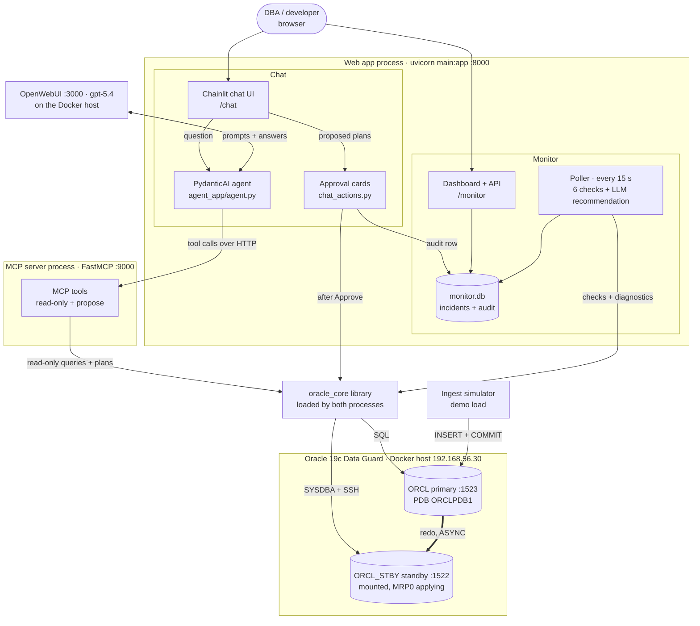
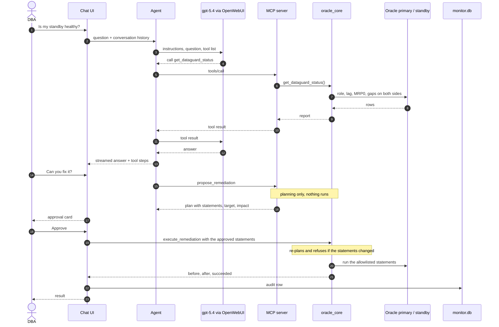
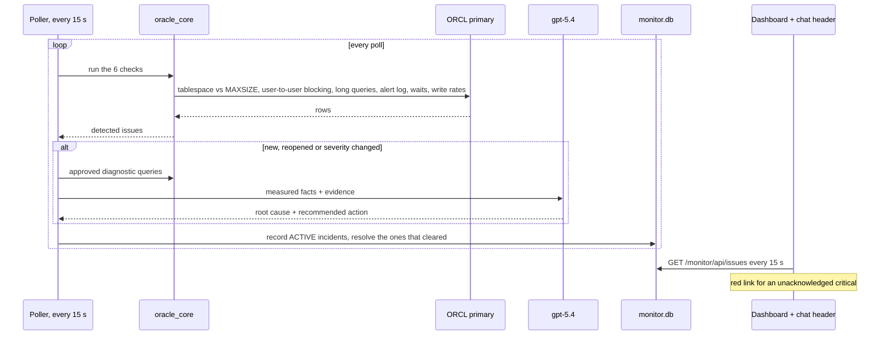

# Architecture

An Oracle DBA assistant: a chat agent that answers questions about a live
Oracle 19c Data Guard pair using read-only tools, a background monitor that
detects incidents and explains them, and a human-approval path for the few
changes it is allowed to make.

## Components

| Component | Where | Role |
| --- | --- | --- |
| Chat UI | `chat.py`, mounted at `/chat` by `main.py` | Conversation, model picker, tool steps, action buttons |
| Approval cards | `chat_actions.py` | Renders proposed fixes, runs them only after **Approve**, writes the audit row. Alternatives share a group; approving one withdraws the rest. |
| Agent | `agent_app/agent.py` | PydanticAI agent with the DBA instructions. Runs inside the web app process; its only toolset is the MCP server, reached over HTTP |
| MCP server | `mcp_server/server.py`, its own process on :9000 | 15 tools: 12 read-only diagnostics (one reads the monitor's incidents), `list_remediation_actions`, and two `propose_*` tools that return plans and execute nothing |
| Shared Oracle layer | `oracle_core/`, a library loaded by both processes | All SQL: `queries.py`, `queries_advanced.py` (ASH, Data Guard), `remediation.py` (allowlisted actions), `db.py` (python-oracledb thin connections). Reaches the standby as SYSDBA, and over SSH + `docker exec` for instance restarts. |
| Monitor | `monitor/` | Poller, 6 checks, approved diagnostics, LLM recommendation, SQLite lifecycle (ACTIVE / RESOLVED), dashboard |
| Header alert | `public/custom.js`, `public/custom.css` | Colours the Monitor link: green, amber, or solid red pulsing for an unacknowledged critical |
| Ingest simulator | `scripts/ingest_simulator.py` | Demo load as schema `LOADGEN` |
| Tracing | `opentelemetry-instrument` + `.env.otel` | Agent, MCP server and monitor send OTLP traces to Jaeger on the Docker host (UI :16686) |
| Data Guard lab | `docker-stuff/00`–`03` | Builds the primary from a seed image and the standby with RMAN duplicate |

## Asking a question, then fixing the problem

The model never writes SQL that runs. It picks an action from an allowlist
and supplies parameters; `oracle_core/remediation.py` builds the statements
from reviewed templates and validates every parameter. Execution happens in
the chat process after a human clicks Approve, and is never reachable through
MCP.

## The monitor cycle

## Allowlisted changes

| Action | Target | Reversible | Runs through |
| --- | --- | --- | --- |
| `restart_redo_apply` | Standby | Yes | SYSDBA SQL |
| `restart_standby_instance` | Standby | No | SQL*Plus in the standby container over SSH (thin mode cannot shut down or start an instance) |
| `enable_tablespace_autoextend` | Primary PDB tablespace | Yes | DDL in the PDB |
| `add_tablespace_datafile` | Primary PDB tablespace | No | DDL in the PDB; the standby creates the file itself (`standby_file_management=AUTO`) |

Every approval and rejection is recorded in `remediation_audit` in
`monitor.db`.
